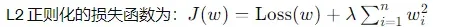
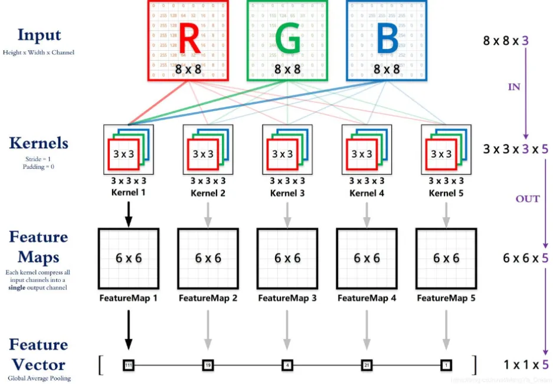
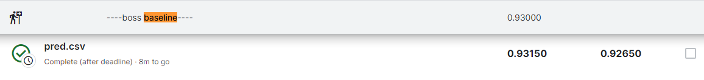

Use local pytorch to train instead of using colab which is not easy to debug and code

学习资料: https://speech.ee.ntu.edu.tw/~hylee/ml/2023-spring.php

待解锁:
1. bn1d bn2d 区别？

## HW1
#### 目标问题分析
回归问题：直接给出特征，要求预测一个scaler
#### 模型搭建过程
搭建FC layer + activation function + bn + Dropout
#### 新优化方法
1. bn:均匀化每个layer的input，避免个别feature对output影响过大
2. dropout:依概率丢掉一些结果，避免过拟合
3. 加大epoch次数
4. L2 regularization: 
   ```python
   # weight_decay is \lamda
    optimizer = torch.optim.AdamW(
       model.parameters(), lr=config["learning_rate"], weight_decay=0.08)
   ```

实际上在某组参数下1和2没能让准确率提高，未来遇到这种情况需要进行调参
#### python/pytorch语法
1. squeeze可以去掉某个维度，0维代表行，1维代表列
2. training/validation data need to shuffel, testing not need
3. torch.cat(preds, dim=0).numpy()可以根据维度来合并张量，最后通过.numpy转化成write_row所需的输出类型
#### 跑分结果
Near strong baseline

## HW2 
#### 目标问题分析
分类问题：输入特征已预处理，实际输入一段音频对应一个二维张量，要求对音频的音调进行分类
#### 模型搭建过程
fc layer + activation function + bn + dropout
#### 新优化方法
1. 学习率自调整：
    ```python
        scheduler = torch.optim.lr_scheduler.CosineAnnealingWarmRestarts(
            optimizer, T_0=8, T_mult=2, eta_min=config["learning_rate"] / 2
        )
    ```

#### python/pytorch语法
1. 引入python unittest，使得函数鲁棒(engineer experience)
2. tensor.unsqueeze(0)，可以将一维向量变成二维，便于合并张量
3. 读取txt
   1. with open(id_lable_path, "r") as file
   2. line = line.strip().split(" ")去掉首尾换行，以空格为分割符

#### 跑分结果
between simple baseline and medium baseline

## HW3 
#### 目标问题分析
图片分类：使用CNN进行图像分类
#### 模型搭建过程
```python
torch.nn.Conv2d(in_channels=3, out_channels=64, kernel_size=3, padding=1)
# padding: 上下左右各补几个像素
```

1. 随着convolutional layers的加深，输出的channel越多，抽取的特征越多。最后一层卷积层输出FeatureMaps，将FM拍扁成一维张量送到FC进行分类训练
2. 因为一次性载入所有数据不可行，因此只在Dataset.getitem方法里真正读取数据去训练
#### 新优化方法
1. 池化pooing：对于输出的结果，以2*2为单位抽出一个代表，可用mean or max
2. transforms.Compose: 对训练集图像进行灰度、亮度、旋转等操作，最后转成张量用于训练，可增强模型的泛化能力和准确性。注意，验证集不需要该操作
3. TTA: Testing time augment，在测试时，将图像经过N次变化，生成N个输入对应N个输出，根据某种算法得出平均值
```python
model = ttach.ClassificationTTAWrapper(
    model, transforms=ttach.aliases.d4_transform(), merge_mode="mean"
)
```
#### python/pytorch语法
使用命令行参数来指定train or inf
```python
if __name__ == "__main__":
    parser = argparse.ArgumentParser(description="hack")
    parser.add_argument(
        "--mode",
        type=str,
        choices=["train", "inference"],
        required=True,
        help="Mode: 'train' or 'inference'",
    )
    parser.add_argument(
        "--load_model_to_train",
        type=str,
        choices=["true", "false"],
    )
    args = parser.parse_args()
    if args.mode == "train":
        train()
    elif args.mode == "inference":
        inference()
```
#### 跑分结果
medium baseline

## HW4
#### 目标问题分析
语音识别分类问题：输入是mel对应音频数据，要求输出该音频对应的人名

#### 模型搭建过程
预处理层→使用self-attention layer抽取特征→fc layer预测结果
#### 新优化方法

目前使用self-attention已经可以达到strong baseline, 关于conformer:Encoderlayer's Multi-head self attention输出在transformer里是直接送进feed-forward layer, 而在conformer里，在两者间加了一层convolutional layer用于学习局部信息

#### python/pytorch语法
1. Dataset是抽象基类，基类没有__init__方法定义;派生于nn.Module一定需要定义__init__ function
2. tqdm.tqdm(train_data["speakers"], desc="Processing init data")加个注释方便观察进度
3. 读取json文件：
   ```python
    with open(json_data_path, "r") as f:
        json_file = json.load(f)
        return json_file
   ```
4. DataLoader的批处理需要每个元素的各个维度相同
   ```python
    train_data_ld = torch.utils.data.DataLoader(
        dataset=train_data_set,
        batch_size=config["batch_size"],
        shuffle=True,
        pin_memory=True,
        collate_fn=SpeakerDataset.train_collate_batch,
    )
    def train_collate_batch(batch):
        mels, lables = zip(*batch)
        mels = torch.nn.utils.rnn.pad_sequence(
            sequences=mels, batch_first=True, padding_value=0
        )
        return mels, torch.tensor(lables, dtype=int)
   ```
5. 保存模型时，使用pkl file保存best_acc用于重载模型训练
   ```python
    # load
    if args.load_model_to_train == "true":
        try:
            model = SpeakerClassifierModel().to(device)
            ckpt = torch.load(config["model_save_path"], map_location="cpu")
            model.load_state_dict(ckpt)
            with open("HW4/best_accuracy.pkl", "rb") as f:
                best_acc = pickle.load(f)
            print(f"Use local model, best_acc:{best_acc}")
        except FileNotFoundError:
            print("No local model")
    # save
    with open("HW4/best_accuracy.pkl", "wb") as f:
                pickle.dump(best_acc, f)
            torch.save(model.state_dict(), config["model_save_path"])
   ```
#### 跑分结果



## 训练模型代码框架总结
命令行模块：根据不同的命令，执行train or inference
#### 训练Train
   1. 数据预处理：加载训练数据 → random → 特征提取 → 以array形式将数据返回
   2. Train/Validation DataSet：定义__init__(), __getitem__(), __len__()。如果数据太大，__getitem()处才会真实加载数据
   3. DataLoader：将MyDataSet放进DataLoader以支持批操作，shuffle
   4. 加载/创建模型：ckpt/初始化
   5. 训练（每次epoch）：每批次数据训练时，清空前一次的梯度值，计算损失结果和梯度，反向传播，更新权重和偏置值
   6. 验证（每次epoch）：每批次数据训练时， with torch.no_grad()
#### 推理Inference
  1. 数据预处理：加载推理数据
  2. 加载模型：ckpt
  3. 推理：类似验证的过程，做计算
  4. 若是图片分类推理，可以采用TTA对图片进行编辑旋转后再测试求个平均值
<!-- 
## HW? 
#### 目标问题分析

#### 模型搭建过程

#### 新优化方法


#### python/pytorch语法

#### 跑分结果
-->
