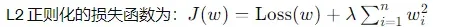

Use local pytorch to train instead of using colab which is not easy to debug and write code

## HW1
#### 目标问题分析
回归问题：直接给出特征，要求预测一个scaler
#### 模型搭建过程
搭建FC layer + activation function + bn + Dropout
#### 优化方法
1. bn:均匀化每个layer的input，避免个别feature对output影响过大
2. dropout:依概率丢掉一些结果，避免过拟合
3. 加大epoch次数
4. L2 regularization: 

实际上在某组参数下1和2没能让准确率提高，未来遇到这种情况需要进行调参
#### python/pytorch语法
1. squeeze可以去掉某个维度，0维代表行，1维代表列
2. training/validation data need to shuffel, testing not need
3. torch.cat()可以根据维度来合并张量，最后通过.numpy转化成write_row所需的输出类型
#### 跑分结果和收获
Near strong baseline

---

## HW2 
#### 目标问题分析

#### 模型搭建过程

#### 优化方法

#### python/pytorch语法

#### 跑分结果和收获

<!-- 
## HW? 
#### 目标问题分析

#### 模型搭建过程

#### 优化方法

#### python/pytorch语法

#### 跑分结果和收获
-->
